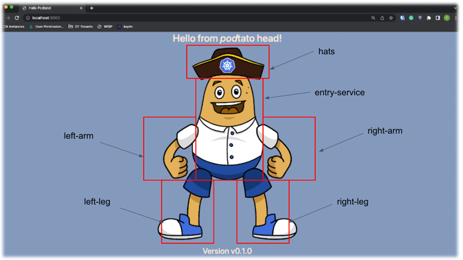
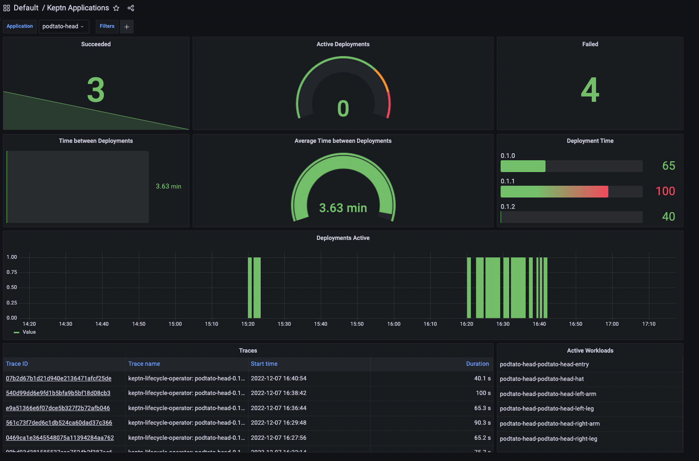
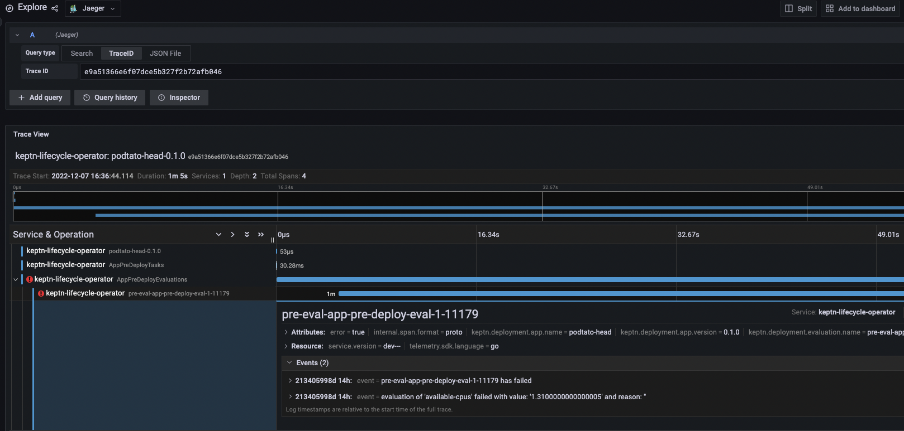

The Keptn Lifecycle Toolkit makes your deployments observable, brings application-awareness to your Kubernetes cluster and helps you reliably delivering your application with:

* Pre-Deployment Tasks: e.g. checking for dependant services, checking if the cluster is ready for the deployment, etc.
* Pre-Deployment Evaluations: e.g. evaluate metrics before your application gets deployed (e.g. layout of the cluster
* Post-Deployment Tasks: e.g. trigger a test, trigger a deployment to another cluster, etc.
* Post-Deployment Evaluations: e.g. evaluate the deployment, evaluate the test results, etc.

All of these things can be executed on a workload or on an application level, whereby an application is a collection of multiple workloads.

## What you will learn here
* Use the Keptn Lifecycle Toolkit to control the deployment of your application
* Connect the lifecycle-toolkit to Prometheus
* Use pre-deployment tasks to check if a dependency is met before deploying a workload
* Use post-deployment tasks on an application level to send a notification

## Prerequisites
* A Kubernetes cluster >= Kubernetes 1.24
    * If you don't have one, we recommend [Kubernetes-in-Docker(KinD)](https://kind.sigs.k8s.io/docs/user/quick-start/) to set up your local development environment
* kubectl installed on your system
    * See (https://kubernetes.io/docs/tasks/tools/) for more information

## Check Kubernetes Version

Run the following and ensure both client and server version are greater than or equal to v1.24.

```
kubectl version --short
```

The output should look like this. In this example, both client and server are at v1.24.0 so the Keptn Lifecycle Toolkit will work.

{}

## Install the Keptn Lifecycle Toolkit
{}

## Check out the Getting Started Repository
For the further progress of this guide, we need a sample application as well as some helpers which makes it easier for your to set up your environment. These things can be found in our Getting Started repository which can be checked out as follows:

```console
git clone https://github.com/keptn-sandbox/lifecycle-toolkit-examples.git
cd lifecycle-toolkit-examples
```

## Install the required observability features
The Keptn Lifecycle Toolkit emits OpenTelemetry data as standard but the toolkit does not come pre-bundled with Observability backend tooling. This is deliberate as it provides flexibility for you to bring your own Observability backend which consume this emitted data.

In order to use the observability features of the lifecycle toolkit, we need a monitoring and tracing backend.

In this guide, we will use [Prometheus](https://prometheus.io/) for Metrics, [Jaeger](https://jaegertracing.io) for Traces and [Grafana](https://github.com/grafana/) for Dashboarding.

```
make install-observability
```

## The Demo Application
For this demonstration, we use a slightly modified version of [the PodTatoHead](https://github.com/podtato-head/podtato-head).



Over time, we will evolve this application from a simple manifest to a Keptn-managed application. We will install it first with kubectl and add pre- as well as post-deployment tasks. For this, we will check if the entry service is available before the other ones get scheduled. Afterwards, we will add evaluations to ensure that our infrastructure is in a good shape before we deploy the application. Finally, we will evolve to a GitOps driven deployment and will notify an external webhook service when the deployment has finished.

## Install the Demo Application (Version 1)
In the first version of the Demo application, the Keptn Lifecycle Toolkit evaluates metrics provided by prometheus and checks if a specified amount of CPUs is available before deploying the application

To install it, simply apply the manifest:
```shell
make deploy-version-1
```

You can watch the progress of the deployment as follows:
<details>
<summary>Watch workload state</summary>
When the Lifecycle Toolkit detects workload labels ("app.kubernetes.io/name" and "keptn.sh/workload") on a resource, a KeptnWorkloadInstance (kwi) resource will be created. Using this resource you can watch the progress of the deployment.

```shell
kubectl get keptnworkloadinstances -n podtato-kubectl
```

This will show the current status of the Workloads and in which phase they are at the moment. You can get more detailed information about the workloads by describing one of the resources:

```shell
kubectl describe keptnworkloadinstances podtato-head-podtato-head-entry -n podtato-kubectl
```

Note that there are more detailed information in the event stream of the object.
</details>

<details>
<summary>Watch application state</summary>
Although you didn't specify an application in your manifest, the Lifecycle Toolkit assumed that this is a single-service application and created an ApplicationVersion (kav) resource for you.

Using `kubectl get keptnappversions -n podtato-kubectl` you can see state of these resources.
</details>

<details>
<summary>Watch pods</summary>
Obviously, you should see that the pods are starting normally. You can watch the state of the pods using:

```shell
kubectl get pods -n podtato-kubectl
```
</details>

Furthermore, you can port-forward the podtato-head service to your local machine and access the application via your browser:

```shell
make port-forward-grafana
```
 
In your browser (http://localhost:3000, Log in with the user 'admin' and the password 'admin'), you can open the Dashboard `Keptn Applications` and see the current state of the application which should be similar to the following:



In this screen you get the following information:
* Successful/Failed Deployments
* Time between Deployments
* Deployment Time per Version
* The link to the Trace of the deployment

After some time (~60 seconds), you should see one more failed deployment in your dashboard. You can click on the link to the trace and see the reason for the failure:



In this case, we see the name of the failed pre-deployment evaluation and the reason for the failure. In this case, the minimum amount of CPUs is not met. This is a problem we can solve by changing the treshold in the evaluation file.

## Install the Demo Application (Version 2)
To achieve this, we changed the operator in the evaluation file (sample-app/version-2/app-pre-deploy-eval) from `<` to `>` and applied the new manifest:

```shell
kubectl apply -f sample-app/version-2
```

After this, you can inspect the new state of the application using the same commands as before. You should see that the deployment is now successful and that the trace is also updated. You should also see in the Grafana Dashboards that the deployment was successful.

Congratulations! You successfully deployed the first application using the Keptn Lifecycle Toolkit!
